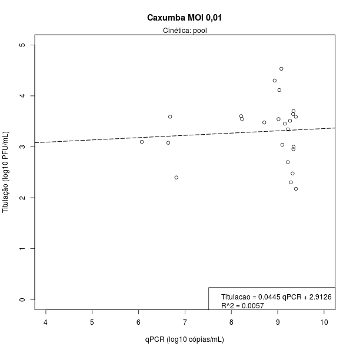
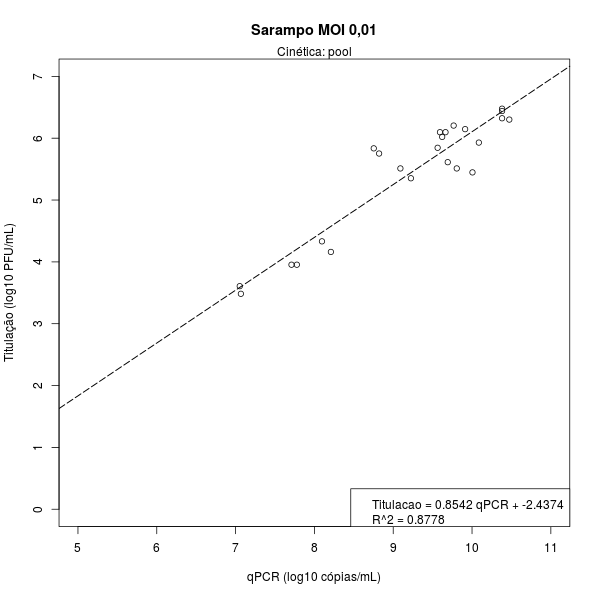
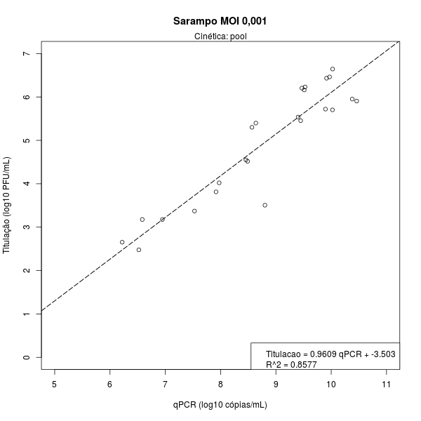
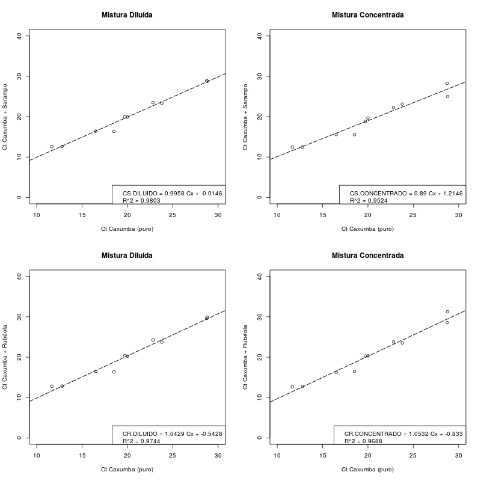

# Análise de dados - Jéssica Malheiros
Felipe Figueiredo  
February 6, 2017  

# Análise de dados Jéssica Malheiros

## Metodologia ##

Os dados ajustados com modelos de regressão linear simples, que foram comparados de acordo com o coeficiente de determinação (R^2) de cada modelo.
Quanto maior o valor de R^2, melhor é o ajuste do modelo aos dados.

As amostras com títulos nulos não foram considerados para os modelos de regressão.

Os modelos obtidos foram apresentados, bem como os coeficientes de determinação foram apresentados em cada gráfico.

Figuras compostas por mais de um gráfico têm escalas iguais, para facilitar a comparação dos resultados.

Todas as análises estatísticas foram feitas usando o software R, versão 3.3.2.

## Resultados ##

### qPCR x Titulação ###

#### Tabela ####

|    &nbsp;    |  Média  |     IC     |  r   |
|:------------:|:-------:|:----------:|:----:|
|  **Cx001**   |  5.37   | 4.89, 5.86 | 0.08 |
|  **Cx0001**  |  5.29   | 4.87, 5.72 | 0.69 |
|  **Sp001**   |  3.78   | 3.63, 3.94 | 0.94 |
|  **Sp0001**  |  3.85   | 3.63, 4.06 | 0.93 |

Table: **Tabela 1** Média das diferenças entre qPCR e Titulação, intervalo de confiança 95%, e correlação de Pearson. Para o invervalo de confiança, foi aplicado o teste t de Student, pareado. 

#### Figuras ####

### Ct ###

